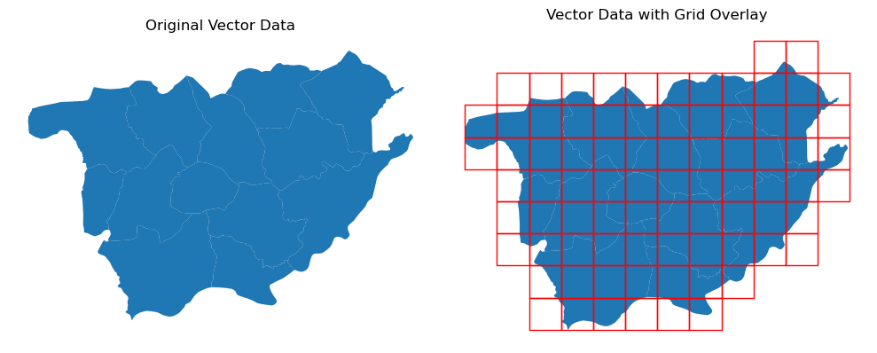

# rasvec

This is a Python library designed to streamline the handling of geospatial data, particularly for machine learning applications. Working with geospatial datasets often involves challenges like rasterization, vectorization, and grid creation—this library provides efficient and easy-to-use functions to simplify these processes.

## features

### vectors

- `clip_vector_by_raster`
- `create_grid_on_vector`
- `rasterize`

### rasters

- `patchify` (divides the raster into geotagged patches)
- `vectorization`

### satellite imagery
- `tms_to_geotiff` 

## example

Here's an example of a feature: Generating a grid over a vector file.


```python
import geopandas as gpd
import matplotlib.pyplot as plt
from rasvec import create_grid_on_vector

gdf = gpd.read_file(r"sample_data/vector/vec/vec.shp")

# 
grid_cells = create_grid_on_vector("sample_data/vector/vec/vec.shp", 1000, "grid.shp")

fig, ax = plt.subplots(1,2, figsize=(10, 10))
gdf.plot(ax=ax[0])
ax[0].set_title("Original Vector Data")
gdf.plot(ax=ax[1])
grid_cells.plot(ax=ax[1], facecolor="none", edgecolor="red")
ax[1].set_title("Vector Data with Grid Overlay")
ax[0].axis("off")
ax[1].axis("off")
plt.tight_layout()

```
The output:



## installation

### Install from PyPi

To install the library from PyPi run the below command in your terminal.

```bash
pip install rasvec
```

### Install from GitHub

To install the development version from GitHub using Git, run the following command in your terminal.

```bash
pip install git+https://github.com/davnish/rasvec.git
```

## acknowledgements

This package was made possible due to the following dependencies.

-   [tms2geotiff](https://github.com/gumblex/tms2geotiff)


